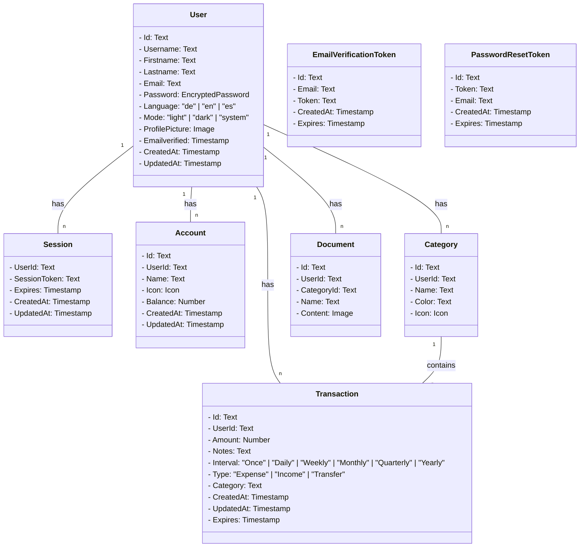
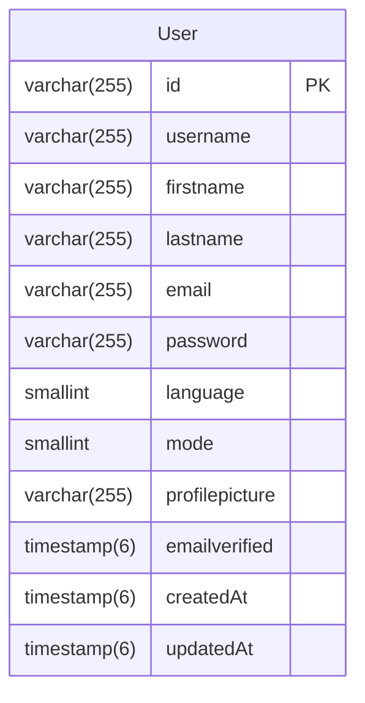

# Datenmodelle
## Fachliches Datenmodell

```mermaid
classDiagram
    class User {
        - Id: Text
        - Username: Text
        - Firstname: Text
        - Lastname: Text
        - Email: Text
        - Password: EncryptedPassword
        - Language: "de" | "en" | "es"
        - Mode: "light" | "dark" | "system"
        - ProfilePicture: Image
        - Emailverified: Timestamp
        - CreatedAt: Timestamp
        - UpdatedAt: Timestamp
    }

    class Session {
        - UserId: Text
        - SessionToken: Text
        - Expires: Timestamp
        - CreatedAt: Timestamp
        - UpdatedAt: Timestamp
    }

    class EmailVerificationToken {
        - Id: Text
        - Email: Text
        - Token: Text
        - CreatedAt: Timestamp
        - Expires: Timestamp
    }

    class PasswordResetToken {
        - Id: Text
        - Token: Text
        - Email: Text
        - CreatedAt: Timestamp
        - Expires: Timestamp
    }

    class Account {
        - Id: Text
        - UserId: Text
        - Name: Text
        - Icon: Icon
        - Balance: Number
        - CreatedAt: Timestamp
        - UpdatedAt: Timestamp
    }

    class Transaction {
        - Id: Text
        - UserId: Text
        - Amount: Number
        - Notes: Text
        - Interval: "Once" | "Daily" | "Weekly" | "Monthly" | "Quarterly" | "Yearly"
        - Type: "Expense" | "Income" | "Transfer"
        - Category: Text
        - CreatedAt: Timestamp
        - UpdatedAt: Timestamp
        - Expires: Timestamp
    }

    class Category {
        - Id: Text
        - UserId: Text
        - Name: Text
        - Color: Text
        - Icon: Icon
    }

    class Document {
        - Id: Text
        - UserId: Text
        - CategoryId: Text
        - Name: Text
        - Content: Image
    }

%%--------------------------------------------
User "1" -- "n" Account : has
User "1" -- "n" Session : has
User "1" -- "n" Transaction : has
User "1" -- "n" Category : has
User "1" -- "n" Document : has
Category "1" -- "n" Transaction : contains
```

### **Begründung des Datenmodells**

## Datenbankmodell (ERD-Modell)

```mermaid
erDiagram

    User {
        varchar(255) id PK
        varchar(255) username
        varchar(255) firstname
        varchar(255) lastname
        varchar(255) email
        varchar(255) password
        smallint language
        smallint mode
        varchar(255) profilepicture
        timestamp(6) emailverified
        timestamp(6) createdAt
        timestamp(6) updatedAt
    }
```