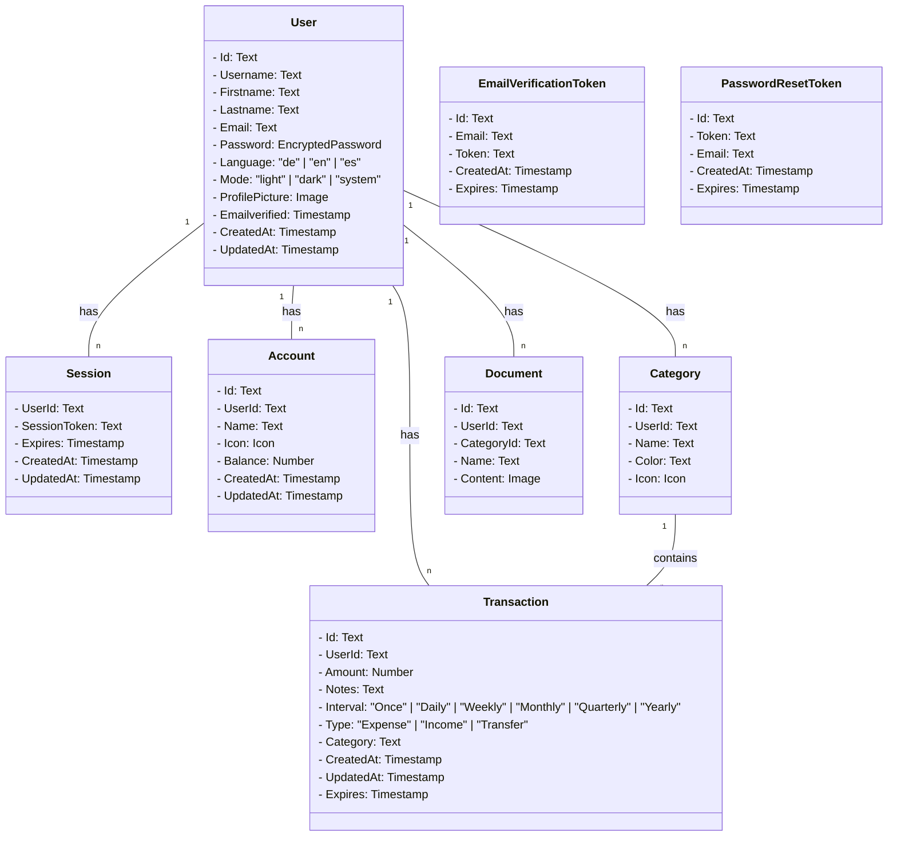
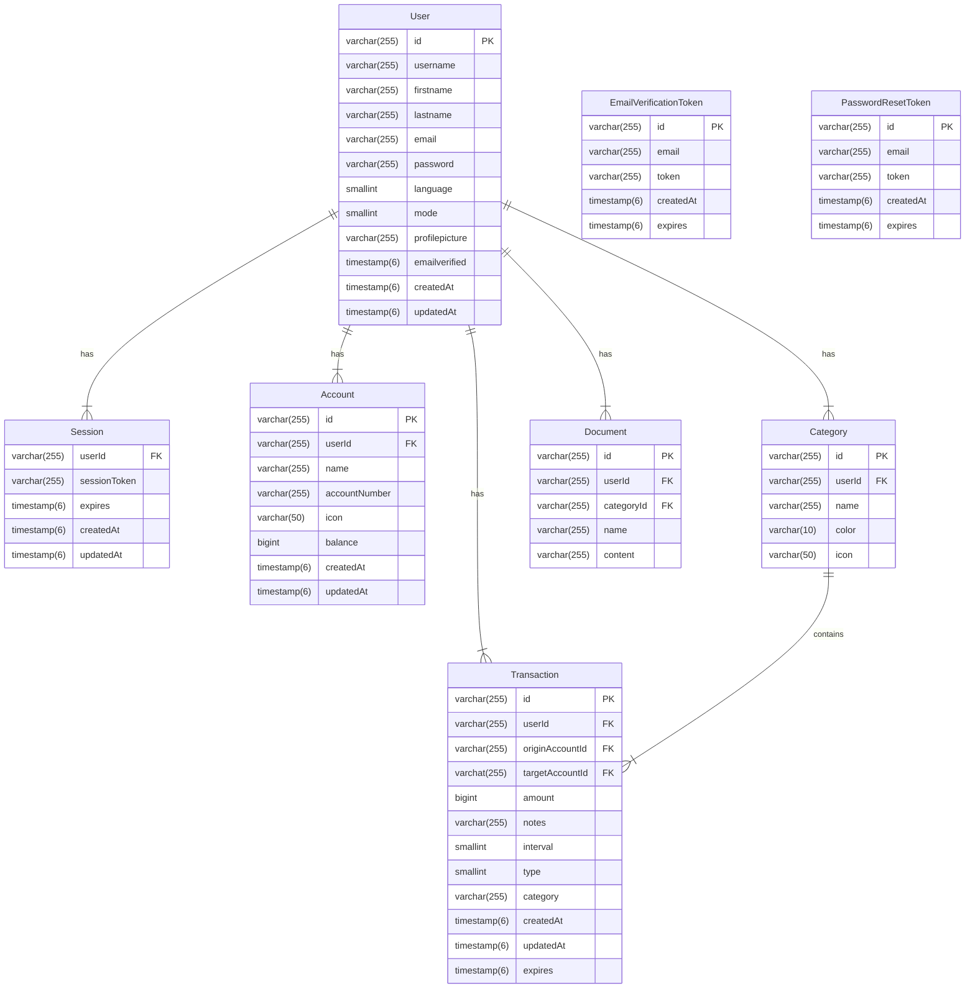

# Datenmodelle
## Fachliches Datenmodell

### Begründung des Datenmodells

Das gezeigte Datenmodell wurde basierend auf den Anforderungen der Anwendung entworfen, um die wichtigsten Funktionalitäten wie Benutzerverwaltung, Accountmanagement, Transaktionen, Dokumente und Kategorien zu unterstützen. 

Hierbei dient dieses Modell als Grundlage, um die fachlichen Zusammenhänge zu verstehen und die Anforderungen klar definieren zu können. Dieses Modell stellt dar, welche Informationen benötigt werden, wie diese miteinander verknüpft sind und welche Daten durch die Anwendung verarbeitet werden sollen.

Es gilt jedoch zu beachten, dass es sich hierbei noch nicht um das technische Datenbankschema handelt. Das fachliche Modell hilft zunächst dabei, alle relevanten Entitäten und ihre Beziehungen zu klären, bevor die eigentliche Implementierung in einer konkreten Datenbank erfolgt. Dadurch können spätere Anpassungen oder Optimierungen im technischen Design besser berücksichtigt werden.

## Datenbankmodell (ERD-Modell)

### Begründung des Datenbankschemas

Das technische Datenbankschema wurde auf Basis des fachlichen Modells entworfen, um Modularität, Erweiterbarkeit und eine effiziente Datenverwaltung sicherzustellen. Es bildet die Grundlage für die Speicherung und Verarbeitung der Daten in der Anwendung und wurde mit folgenden Designentscheidungen umgesetzt:

1. **Modularität und Erweiterbarkeit**  
   Die Struktur des Schemas erlaubt eine einfache Anpassung und Erweiterung.

2. **Entkopplung und Trennung von Verantwortlichkeiten**  
   Die Tabellen sind klar voneinander getrennt und repräsentieren jeweils eine bestimmte Domäne (z. B. Benutzer, Dashboard, Accounts oder Transaktionen). Dadurch wird die Übersichtlichkeit erhöht, und redundante Daten werden vermieden.

3. **Strukturierte Hierarchie und Verknüpfung**  
   Das Schema zeigt eine klare Verknüpfung zwischen den verschiedenen Elementen. Zum Beispiel:
   - Ein Benutzer (`User`) besitzt Dokumente (`Document`), die wiederum zu einer Kategorie (`Category`) gehören. 
   - Ein Benutzer (`User`) hat Transaktionen (`Transaction`) ausgeführt und diese wiederum verweisen auf ein Konto (`Account`). 

## Zusammenfassung

